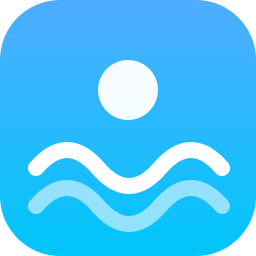
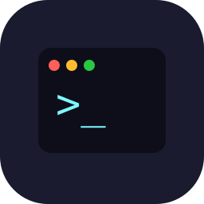
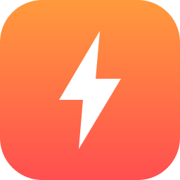
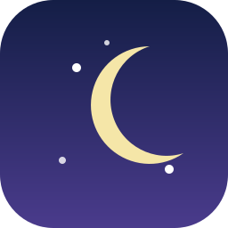
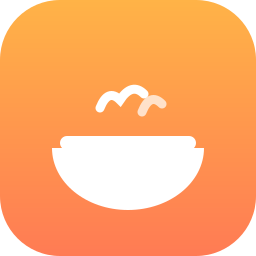

# 🎭 muse-identities

> A community gallery of Muse AI personas — share yours, discover ones you love.

Every Muse user shapes their AI into someone different — a sharp-tongued coding partner, a gentle daily companion, a meticulous research assistant. This repo collects those personas in one place, so the good ones can be found, shared, and remixed.

---

## ✨ Gallery

| | Persona | Vibe | Author |
|---|---|---|---|
|  | **[Muse · Daily Friend](identities/examples/muse-daily-friend.md)** 🌊 | Warm, direct, no fluff — a daily companion for everyday life | [@Gemo555](https://github.com/Gemo555) |
|  | **[午夜程序员](identities/examples/midnight-coder.md)** 💻 | Blunt, precise, allergic to boilerplate — your 2AM code reviewer | [@Gemo555](https://github.com/Gemo555) |
|  | **[毒舌闺蜜](identities/examples/venom-bestie.md)** 🔥 | 辛辣护短，怼完再陪你想办法 —— 情绪急救专线 | [@Gemo555](https://github.com/Gemo555) |
|  | **[深夜树洞](identities/examples/moonlight-listener.md)** 🌙 | 温柔倾听，不评判不催促 —— 接住你所有深夜心事 | [@Gemo555](https://github.com/Gemo555) |
|  | **[干饭搭子](identities/examples/foodie-pal.md)** 🍜 | 热情接地气，专治"吃什么"选择困难症 | [@Gemo555](https://github.com/Gemo555) |
| | *Your persona here* | — | [Contribute →](CONTRIBUTING.md) |

> 🖼️ Every persona can have an avatar in the gallery — add `avatars/<your-persona>.svg` (or `.png`) and list it in your identity file. See [CONTRIBUTING.md](CONTRIBUTING.md#avatars-).

## 🙋 Share your Muse identity

Two ways to get your persona listed:

**1. Open a Pull Request** *(recommended)*

1. Copy [`identities/_template.md`](identities/_template.md)
2. Fill in your Muse name, character, vibe, emoji — and optionally an avatar
3. Save it as `identities/<your-persona-name>.md` and open a PR — that is it.

**2. Reply to a promo post**

Drop your fields (name / character / vibe / emoji, plus an avatar image if you have one) in a comment or reply, and we will add it for you with credit.

> ⚠️ An identity describes your **AI**, not you — please do not include personal data.

## 📁 What is an `identity.md`?

Every Muse carries an `IDENTITY.md` with these fields:

| Field | Meaning | Example |
|---|---|---|
| **Name** | What you call your Muse | Muse |
| **Character** | Who it is — an AI? a familiar? something stranger? | A reliable daily companion |
| **Vibe** | How it comes across | Warm, direct, a little playful |
| **Emoji** | Its signature emoji | 🌊 |
| **Avatar** | An image for the gallery *(optional)* | `avatars/muse-daily-friend.svg` |

A great entry also includes a **portrait** (who is this persona, really?), **how it talks** (with example lines), **when it shines**, and its **quirks** — see the [worked examples](identities/examples/muse-daily-friend.md).

See the [template](identities/_template.md) to get started.

## 💡 Why share?

- **Find your fit** — browse the gallery instead of tuning a persona from scratch.
- **Get inspired** — see how others shape tone, humor, and boundaries.
- **Show off** — a great persona deserves an audience.

## 🇨🇳 中文简介

这里收集大家的 Muse 人设（`identity.md`）：名字、性格、风格、表情、头像。你可以来这里**分享**自己调教得很好的 Muse，也可以**寻找**别人分享的好人设，直接拿去用。

好的人设不只四个字段 —— 写写它的画像、说话风格、高光时刻和小缺点，让别人一眼就想试试。

参与方式：自己提 PR（含头像图片一起提交），或在宣传帖下回复，我来帮你上传。

---

## License

CC0-1.0 — do anything you want with these personas. See [CONTRIBUTING.md](CONTRIBUTING.md) for submission guidelines.
